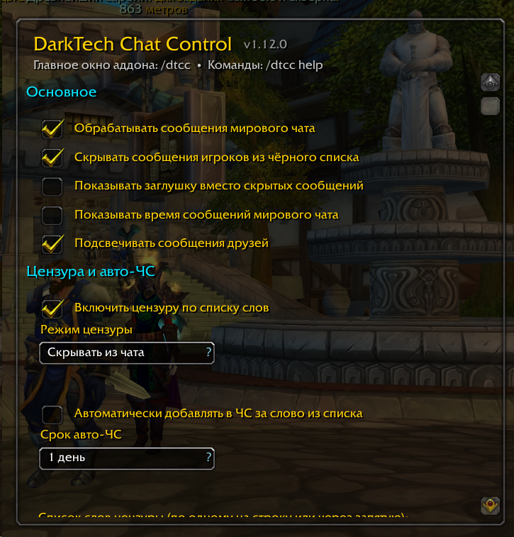

# DarkTech Chat Control [DTCC]

Аддон для **World of Warcraft: Wrath of the Lich King (3.3.5a)**, созданный для серверов
с межфракционным мировым чатом (команда `.chat`, серверы на AzerothCore с модулем
[mod-world-chat](https://github.com/azerothcore/mod-world-chat) — например, PikaWoW).

Клиентский Blizzard-игнор против такого чата бессилен (сообщения приходят как системные,
а игроки другой фракции в него не добавляются). DTCC приносит в мировой чат привычные
инструменты: чёрный список, друзей, цензуру и лог.

> 

## Установка

1. Скачайте последнюю версию:
   **[main.zip](https://github.com/DarkTechCode/darktech-chat-control/archive/refs/heads/main.zip)**
   (ссылка на GitHub, всегда отдаёт актуальную сборку ветки `main`).
2. Распакуйте архив — внутри одна папка `darktech-chat-control-main`.
3. Переименуйте её в `DarkTechChatControl` и скопируйте в папку игры:
   `World of Warcraft\Interface\AddOns\`, чтобы получилось
   `Interface\AddOns\DarkTechChatControl\DarkTechChatControl.toc`.
   Если аддон уже стоял — замените папку целиком.
4. Запустите игру и убедитесь, что аддон включён (экран выбора персонажа →
   «Аддоны»).

Обновление — те же шаги 1–3 и полный перезапуск игры: состав файлов
аддона кэшируется при старте клиента, после замены файлов одного
`/console reloadui` недостаточно.

## Возможности

- **Чёрный список (ЧС)** — свой, независимый от игрового:
  - сроки: 1 день / 3 дня / неделя / месяц / навсегда, с авто-удалением истёкших записей;
  - сообщения игроков из ЧС скрываются (опционально — заглушка `[DTCC] … сообщение скрыто`);
  - у каждой записи видна **причина** — сообщение, за которое игрок был добавлен;
  - колонки: игрок, дата добавления, срок, причина; **сортировка кликом по заголовку
    столбца** (повторный клик меняет направление), выбор запоминается.
- **Список друзей** — сообщения друзей помечаются зелёной меткой `[ДРУГ]`;
  друзья не попадают под авто-ЧС.
- **Цензура** — отдельная вкладка в окне аддона:
  - редактор списка слов на всю вкладку: сохранённые слова грузятся в поле
    при открытии, «Построчно»/«Через запятую» переформатируют текст,
    «Сохранить» записывает (разделители: строка/запятая/точка с запятой,
    регистр не важен, повторы убираются, список сортируется);
  - режим «маскировать» (`***`, с учётом длины слова) или «скрывать из чата»
    (сообщение с запрещённым словом не показывается вообще — в логе остаётся);
  - регистр и кириллица учитываются (Ё/ё тоже).
- **Авто-ЧС по цензуре** — написал запрещённое слово → автоматически в ЧС
  на выбранный срок (1 день / 3 дня / неделя / месяц / навсегда); исходное сообщение
  сохраняется как причина и виден в списке ЧС. Переключатель и срок — на вкладке «Цензура».
- **Лог чата** — полная история сообщений с поиском и фильтрами:
  - поиск по тексту и по имени игрока (без учёта регистра);
  - фильтр по периоду (сегодня / 3 дня / неделя / месяц / всё);
  - фильтры-галочки в одну строку (перенос на вторую — только когда не
    помещаются): источники — «Мировой чат» (сообщения `.chat` без тега из
    списка; по умолчанию включён ТОЛЬКО он), отдельная галочка на каждый
    тег/канал из настроек (например, «Solo» и «Solo Progress»), локальные
    чаты — «Общий» (/say и крики), «Группа» (группа и рейд), «Гильдия»,
    «Шёпот» (приваты; исходящие помечены стрелкой `→`), и «RAW» (системные
    строки: входы, достижения и т.п.); типы — Друзья / ЧС / Скрытые /
    Цензура / Авто-ЧС (несколько отмеченных показываются
    вместе — «ИЛИ»); первой в ряду стоит «Все» — включает/выключает все
    галочки фильтров разом и подсвечивается при полном наборе; состояние
    фильтров запоминается. Включение
    галочки источника прокручивает лог к самым свежим записям этого
    источника — старые записи (например, RAW-входы) не остаются «за кадром»
    ниже свежих сообщений;
  - локальные чаты только логируются: без цензуры, авто-ЧС и скрытия —
    сообщения группы и гильдии всегда остаются читаемыми в чате;
    записи помечаются цветным тегом `[Общий]`/`[Группа]`/`[Гильдия]`/`[Шёпот]`,
    записи каналов — тегом `[Канал]`;
  - кнопка «Очистить лог» удаляет только записи, видимые при текущих
    фильтрах (галочки, поиск, период) — например, можно очистить весь RAW,
    сохранив мировой чат; в диалоге подтверждения видно, сколько записей
    подпадает;
  - кнопка «Debug» открывает окно с сырыми строками чата, собранными
    режимом отладки (`/dtcc debug on`): коды цвета экранированы
    (`!cff…` — иначе поле ввода рендерит их и копия теряет коды), текст
    выделяется целиком, остаётся нажать Ctrl+C — удобно пересылать автору
    для разбора формата; в правом верхнем углу окна — кнопка
    включения/выключения самого режима отладки;
  - шрифт записей — как в игровом чате (заметно крупнее прежнего мелкого),
    колонки времени/имени — тем же шрифтом;
  - цвет имени автора — как в чате: ник остаётся таким, каким его красит
    сервер (на PikaWoW — белым), а вот тег `[Solo]` / `[Solo Progress]`
    в логе красится **фракцией отправителя** (синий — альянс, красный —
    орда), как в самом чате; для источников без цвета сервера (приваты,
    группа, гильдия, обычный чат) ник подсвечивается запомненным
    фракционным цветом игрока; цвета ЧС/друзьев имеют приоритет;
  - сообщение из канала помечается тегом `[Канал]` перед текстом (имя канала
    также видно в подсказке по строке);
  - сообщение занимает всю ширину окна и переносится на несколько строк
    (без обрезки «…»); колонки компактные, колонка «Отметки» убрана;
  - ссылки предметов в сообщениях работают как в игровом чате: клик по ссылке
    открывает подсказку предмета (тултип при наведении клиент 3.3.5 в чате
    не показывает — на более новых клиентах подключён автоматически);
  - ПКМ по строке — действия над игроком (в ЧС, в друзья и т.д.);
  - кнопка «Очистить лог» в правом верхнем углу вкладки (с подтверждением);
  - лог хранится в SavedVariables и переживает перезаход (настраиваемый размер).
- **Алерты о близости игроков из ЧС** (в духе SilverDragon):
  - детект: наведение курсора, цель, фокус, а также `/say`, крик и эмоции рядом;
  - вывод: всплывающее окно с именем и причиной (ЛКМ — взять в цель), Raid Warning,
    сообщение в чат, красная строка по центру экрана, звук (на выбор);
  - настраиваемая пауза между алертами об одном игроке.
- **Отправка в мировой чат** — команда `/dtcc send` (само подставляет `.chat`,
  ничего писать в `/s` не нужно).
- Кнопка на миникарте (совместима с коллекторами кнопок вроде DragonUI),
  страница настроек в «Настройки интерфейса → Аддоны».

## Требования

- Клиент WotLK 3.3.5a (build 12340), ruRU или enUS.
- Сервер с мировым чатом, рассылающим сообщения как системные в формате
  `[Тег][фракция][|Hplayer:Имя|hИмя|h|r]: текст` (стандарт модуля mod-world-chat).

## Быстрый старт

```
/dtcc              — открыть/закрыть окно аддона (вкладки: ЧС, Друзья, Лог, Цензура)
/dtcc add Имя      — добавить в ЧС навсегда
/dtcc add Имя 3    — добавить в ЧС на 3 дня
/dtcc remove Имя   — убрать из ЧС
/dtcc friend Имя   — добавить в друзей
/dtcc unfriend Имя — убрать из друзей
/dtcc send текст   — написать в мировой чат
/dtcc log          — открыть лог
/dtcc words        — вкладка цензуры (слова, авто-ЧС)
/dtcc options      — настройки
/dtcc testalert    — проверить алерт
/dtcc help         — все команды
```

Настройки: **Esc → Настройки интерфейса → Аддоны → DarkTech Chat Control**
(или ПКМ по кнопке на миникарте).

В окне аддона: ПКМ по строке чёрного списка/лога открывает меню действий
(удалить, сделать бессрочным, добавить игрока в ЧС за конкретное сообщение и т.д.).
Окно растягивается за уголок в правом нижнем углу: списки показывают больше
строк, сообщения в логе переносятся по более широкой колонке, а редактор слов
цензуры растягивается на всю вкладку. Размер и положение окна запоминаются.

## Как это работает

Серверный модуль мирового чата рассылает сообщения как `CHAT_MSG_SYSTEM` в виде:

```
[World][|T...AllianceIcon...|t][|cff0070DE|Hplayer:Имя|hИмя|h|r]: |cffFFFFFFтекст|r
```

DTCC регистрирует фильтр на `CHAT_MSG_SYSTEM`, разбирает строку (имя — из ссылки
`|Hplayer:`, текст — после `]: `) и применяет ваши правила: лог, ЧС, цензуру,
метки друзей и время. Скрытие делается фильтром, изменение строки — заменой
сообщения своим (ссылки игрока и префикс сервера сохраняются). Конкретный тег
(`[World]`, `[Мир]` и т.п.) не важен — важна структура «ссылка игрока + разделитель».

**Три варианта доставки:**
- *системные сообщения* (по умолчанию) — так работает стандартный mod-world-chat;
- *теги системных строк* — если сервер раскладывает чат по тегам в начале
  строки (PikaWoW: `[Solo]`, `[Solo Progress]`), перечислите их в настройках
  («Источник мирового чата → Чаты»). Каждому тегу — своя галочка-фильтр и
  тег `[Чат]` перед сообщением в логе; строки с другими тегами и без тега
  остаются в «Мировом чате». Для строк без ссылки-игрока распознаётся и
  упрощённый формат `[Тег] Имя: сообщение`;
- *каналы* — если сервер доставляет чат пользовательскими каналами, укажите
  их имена там же, через запятую. Галочки-фильтры появляются на вкладке
  «Лог» сразу после ввода (и при каждом её открытии); сообщения проходят
  полный конвейер (цензура, ЧС, лог). Сохранённая в старых версиях
  одиночная настройка «Solo» автоматически дополняется до
  «Solo, Solo Progress». Не уверены, как именно сервер доставляет сообщения —
  включите `/dtcc debug on`: строки `КАНАЛ […]` означают канал, `СИСТ:` —
  системные строки (тег виден в начале).

**Цвет имён и тегов.** На PikaWoW фракцию отправителя несёт цвет тега чата:
`[|cff3399FFSolo|r]` — альянс, `[|cffCC0000Solo|r]` — орда; ник сервер красит
белым (класс в строке не присылается). DTCC переносит это в лог: тег `[Чат]`
красится фракцией, ник — цветом сервера; фракционный цвет запоминается по
игроку и подсвечивает его записи из источников без цвета (приваты, группа,
гильдия, обычный чат, строки без ссылки-игрока).

**Локальные чаты.** /say, крики, группа/рейд, гильдия и приваты пишутся в лог
как есть (с цветными тегами) — фильтрацией чата DTCC их не трогает: ни цензура,
ни авто-ЧС, ни скрытие на них не действуют, сообщения всегда видны в чате
как обычно. В логе у записей есть только информационные флаги ЧС/друзей,
чтобы типы-фильтры работали и по ним.

**Запасной формат.** Если сервер переделал формат до неузнаваемости, укажите
тег (например `[Мир]`) — тогда работает и упрощённый формат `[Мир] Имя: текст`.

**Если сообщения не перехватываются:** включите `/dtcc debug on` — в чат будут
печататься все системные сообщения и сообщения каналов (с именем канала),
коды цвета показываются как `!cff…`, чтобы строку можно было скопировать как есть.
По этим строкам сразу видно, в каком виде чат приходит, и что указать в настройках
(или пришлите строку автору — парсер задаётся в одном месте, `Capture.lua`).

Парсер трёхуровневый: точный формат mod-world-chat → толерантный (любая ссылка
игрока, за которой до двоеточия только скобки/цвета/пробелы — ловит форки модуля) →
сырой захват (строка со ссылкой игрока пишется в лог с меткой RAW, без обработки).
При первом распознанном сообщении аддон напечатает подтверждение в чат.

## Данные и совместимость

- Всё хранится в `DarkTechCC_DB` (общая на аккаунт — мировой чат общий для всех
  ваших персонажей на сервере).
- Алерты не зависят от SilverDragon: в версии для 3.3.5 (2.3.4) нет popup-API,
  поэтому у DTCC собственное окно в том же стиле. Ставить SilverDragon не обязательно.
- Все выпадающие списки и меню — собственные (не Blizzard UIDropDownMenu):
  предсказуемо работают в кастомных окнах и вместе с аддонами, перекрашивающими
  интерфейс (DragonUI и т.п.).
- Аддон не меняет исходящие сообщения (кроме явной отправки через `.chat`),
  не пишет в чат от вашего имени и не отправляет ничего на сервер.

## Ограничения

- Захват рассчитан на формат mod-world-chat (точный и толерантный уровни + сырой
  RAW-захват строк со ссылкой игрока); если сервер доставляет чат совсем другим
  событием — это покажет `/dtcc debug on`.
- Лог пишется на диск при выходе из игры — при вылете клиента последние записи теряются.
- Цензура ищет подстроку: слово `нос` найдётся и внутри других слов. Учтите при
  составлении списка.
- Детект «рядом» работает по событиям (курсор/цель/фокус/говорит) — через стены
  и без событий игроков не находит.

## Структура

```
DarkTechChatControl/
├── DarkTechChatControl.toc
├── Core.lua      — ядро: база, UTF-8 утилиты, слэш-команды
├── Widgets.lua   — собственные дропдауны и всплывающие меню
├── Lists.lua     — чёрный список и друзья
├── Censor.lua    — список слов, поиск, маскировка
├── Capture.lua   — перехват сообщений, конвейер правил, лог, отправка
├── Alerts.lua    — детект ЧС рядом, попап, звуки
├── Options.lua   — страница настроек
├── Window.lua    — главное окно (ЧС / Друзья / Лог / Цензура)
└── Minimap.lua   — кнопка на миникарте
```

## Лицензия

MIT — используйте и меняйте как хотите.
